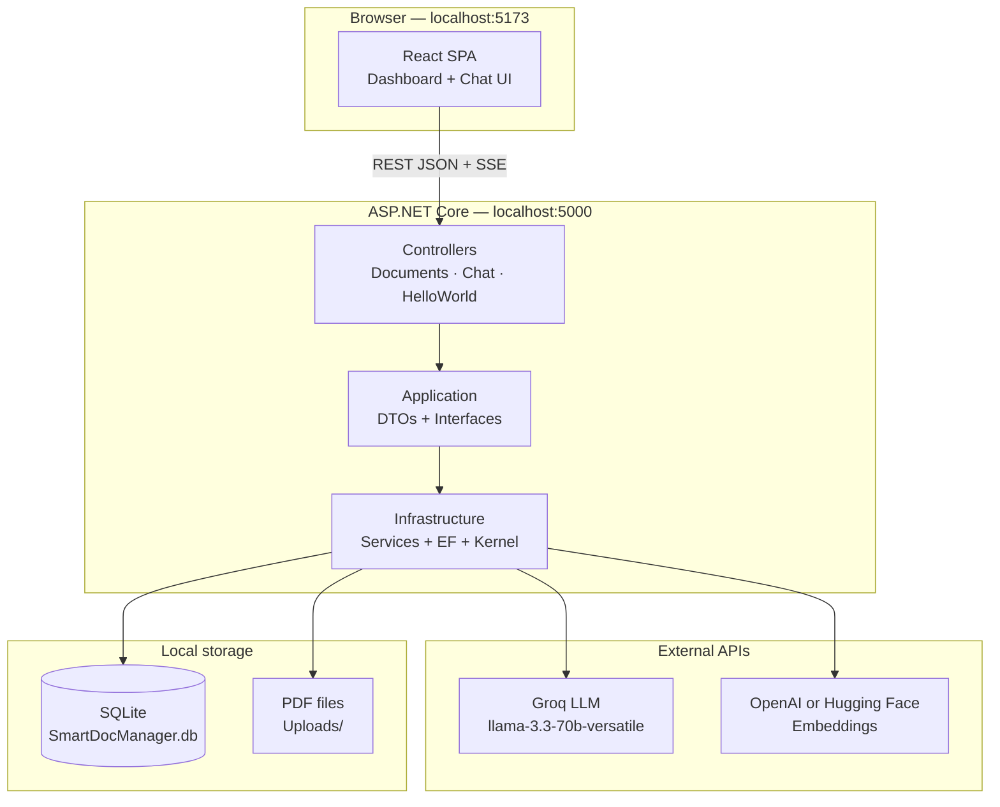
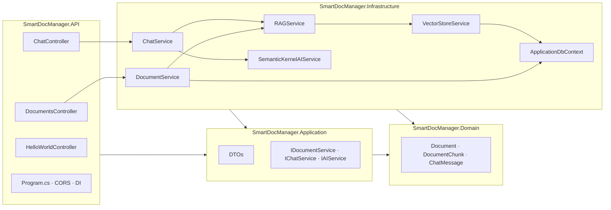
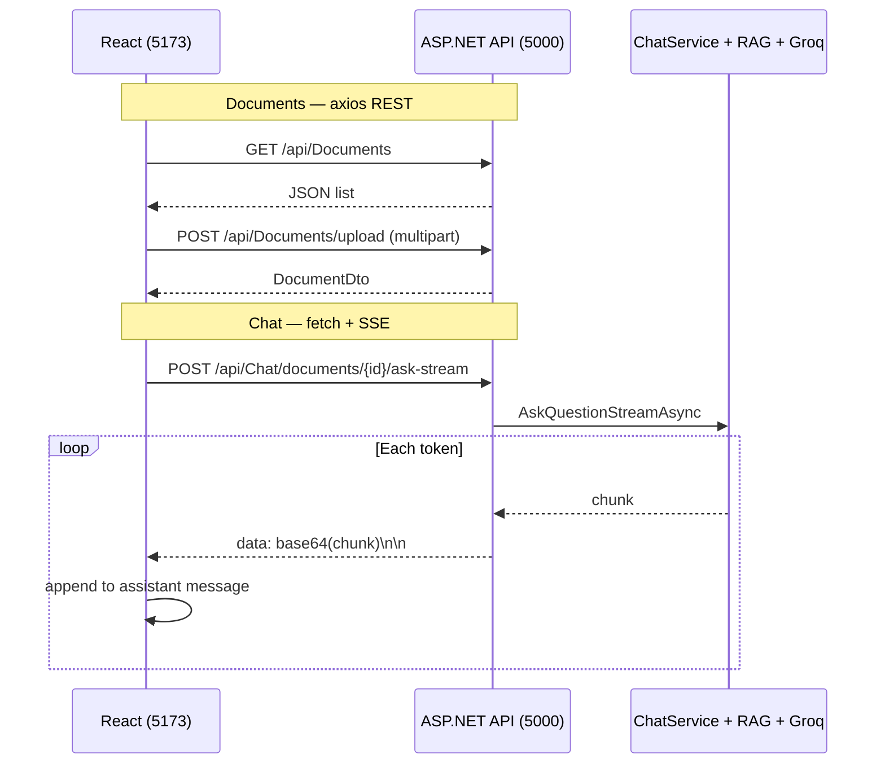
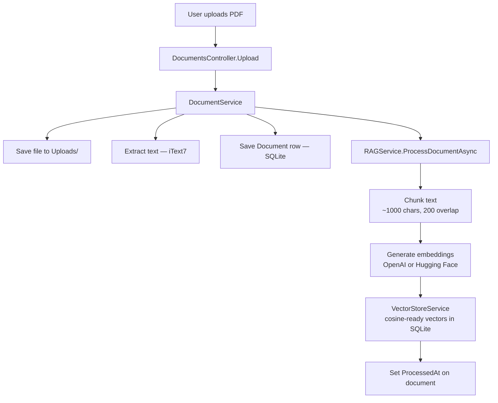
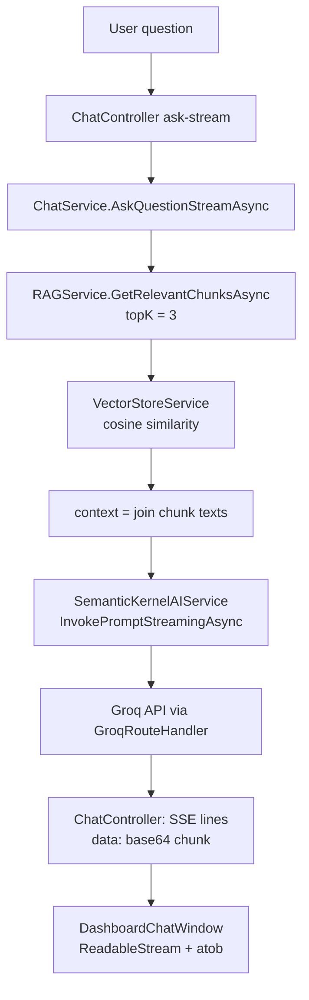
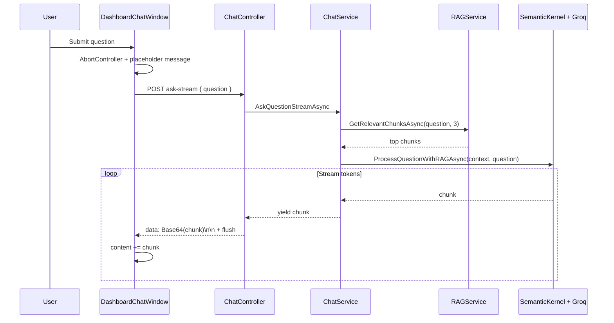
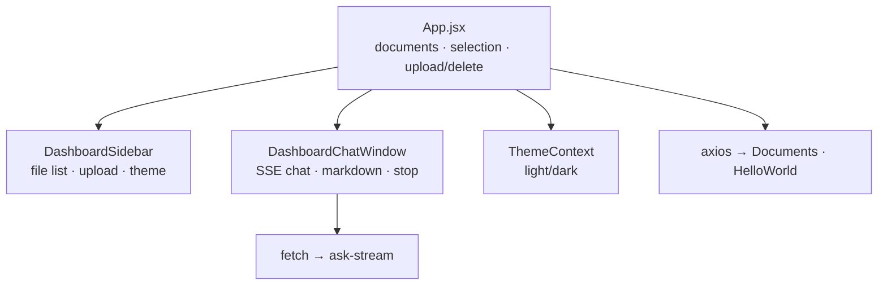

# SmartDocManager — Architecture Cheat Sheet

Quick reference for interviews, onboarding, and system design discussions.

---

## Elevator pitch

**SmartDocManager** is a full-stack PDF document manager with **AI chat backed by RAG**. Users upload PDFs; the backend extracts text, chunks and embeds it into a **SQLite vector store**, then answers questions using **retrieval + LLM streaming**. Frontend: **React + Vite**. Backend: **.NET 10** with **Clean Architecture**.

---

## Repository layout

```
SmartDocManager/
├── backend/                          # .NET solution (4 projects)
│   ├── SmartDocManager.API/          # HTTP: controllers, Program.cs, appsettings
│   ├── SmartDocManager.Application/  # DTOs + service interfaces
│   ├── SmartDocManager.Domain/       # Entities (Document, DocumentChunk, …)
│   └── SmartDocManager.Infrastructure/  # EF Core, RAG, AI, vector store
├── frontend/                         # React SPA (Vite, Tailwind)
│   └── src/
│       ├── App.jsx                   # Document state, upload/delete
│       ├── components/               # Sidebar, chat, UI primitives
│       └── contexts/ThemeContext.jsx
├── docs/
│   └── ARCHITECTURE_CHEATSHEET.md    # ← this file
└── README.md                         # Setup + streaming implementation details
```

---

## High-level system diagram



---

## Backend — Clean Architecture layers



| Layer | Responsibility | Depends on |
|-------|----------------|------------|
| **API** | HTTP, routing, CORS, startup | Application interfaces |
| **Application** | Contracts + DTOs | Domain (conceptually) |
| **Domain** | Core entities | Nothing (pure models) |
| **Infrastructure** | EF, file I/O, RAG, AI, Groq | Application + Domain |

---

## Frontend ↔ backend communication



| Operation | Client | Endpoint | Format |
|-----------|--------|----------|--------|
| Health check | axios | `GET /api/HelloWorld` | JSON |
| List documents | axios | `GET /api/Documents` | JSON |
| Upload PDF | axios | `POST /api/Documents/upload` | `multipart/form-data` |
| Delete document | axios | `DELETE /api/Documents/{id}` | — |
| Ask (full) | — | `POST /api/Chat/documents/{id}/ask` | JSON body `{ question }` |
| Ask (stream) | **fetch** | `POST /api/Chat/documents/{id}/ask-stream` | **SSE** |

**Dev notes**

- API: `http://localhost:5000` (`launchSettings.json`)
- Frontend: `http://localhost:5173` (`vite.config.js`)
- CORS allows `5173` and `3000` (`Program.cs`)
- Vite proxies `/api` → `5000`, but app code often uses **hardcoded** `http://localhost:5000/api` — CORS is required

---

## Upload & RAG indexing flow



---

## Chat / RAG / streaming flow





**Why RAG?** The LLM receives only **top-k relevant chunks**, not the full PDF — lower cost, faster, more focused answers.

---

## Key services (backend)

| Service | Role |
|---------|------|
| `DocumentService` | Upload, CRUD, PDF extraction, trigger indexing |
| `RAGService` | Chunking, embeddings, similarity retrieval |
| `VectorStoreService` | SQLite vector storage + search |
| `ChatService` | Orchestrates RAG + AI for ask / ask-stream |
| `SemanticKernelAIService` | Prompt + streaming via Microsoft Semantic Kernel |
| `GroqRouteHandler` | Rewrites OpenAI-compatible calls to `api.groq.com` |

---

## Configuration (`appsettings*.json`)

| Section | Purpose |
|---------|---------|
| `ConnectionStrings:DefaultConnection` | SQLite file path |
| `Groq:ApiKey`, `ModelId`, `Endpoint` | LLM (chat) |
| `RAG:EmbeddingProvider` | `openai` or `huggingface` |
| `RAG:EmbeddingModel` | e.g. `text-embedding-3-small` |
| `OpenAI:ApiKey` / `HuggingFace:ApiKey` | Embeddings provider |

---

## Frontend structure



---

## API quick reference

| Method | Route | Description |
|--------|-------|-------------|
| GET | `/api/HelloWorld` | Connectivity check |
| GET | `/api/Documents` | List all documents |
| GET | `/api/Documents/{id}` | Get one document |
| POST | `/api/Documents/upload` | Upload PDF (`IFormFile file`) |
| DELETE | `/api/Documents/{id}` | Delete document |
| POST | `/api/Chat/documents/{id}/ask` | Full JSON answer |
| POST | `/api/Chat/documents/{id}/ask-stream` | SSE token stream |

---

## Run locally

```bash
# Terminal 1 — API
cd backend/SmartDocManager.API
dotnet run
# → http://localhost:5000

# Terminal 2 — UI
cd frontend
npm install
npm run dev
# → http://localhost:5173
```

---

## Interview sound bites

1. **Architecture style:** Clean Architecture — API thin, business behind interfaces, infrastructure swappable.
2. **RAG pipeline:** Upload → extract → chunk → embed → store → query embeds → retrieve top-k → prompt LLM with context only.
3. **Streaming:** SSE from API; base64 per chunk avoids newline parsing issues; `CancellationToken` + `AbortController` for stop.
4. **AI stack:** Semantic Kernel orchestration; Groq for LLM; OpenAI or HF for embeddings.
5. **Persistence:** SQLite for metadata + vectors; PDFs on disk under `Uploads/`.
6. **Gaps / extensions:** No auth yet; SQLite/file storage fine for MVP; could add Redis, blob storage, auth middleware, scoped retrieval per `documentId`.

---

## Mock Q&A

**Q: What does the frontend own vs the backend?**  
A: Frontend — UX, document list state, streaming display, theme. Backend — extraction, indexing, vector search, LLM, persistence.

**Q: Why SSE and not WebSockets?**  
A: One-way server→client token stream fits SSE; simpler than WebSockets for this use case; works with `fetch` + `ReadableStream`.

**Q: How is Groq integrated if you use Semantic Kernel?**  
A: `OpenAIChatCompletionService` with a custom `HttpClient` handler (`GroqRouteHandler`) that rewrites the host to `api.groq.com`.

**Q: What happens if RAG isn’t ready when the user asks?**  
A: `ChatService` throws `InvalidOperationException` if no relevant chunks — controller returns 400 / SSE error JSON.

---

## Related docs

- [README.md](../README.md) — setup, config table, detailed streaming implementation
